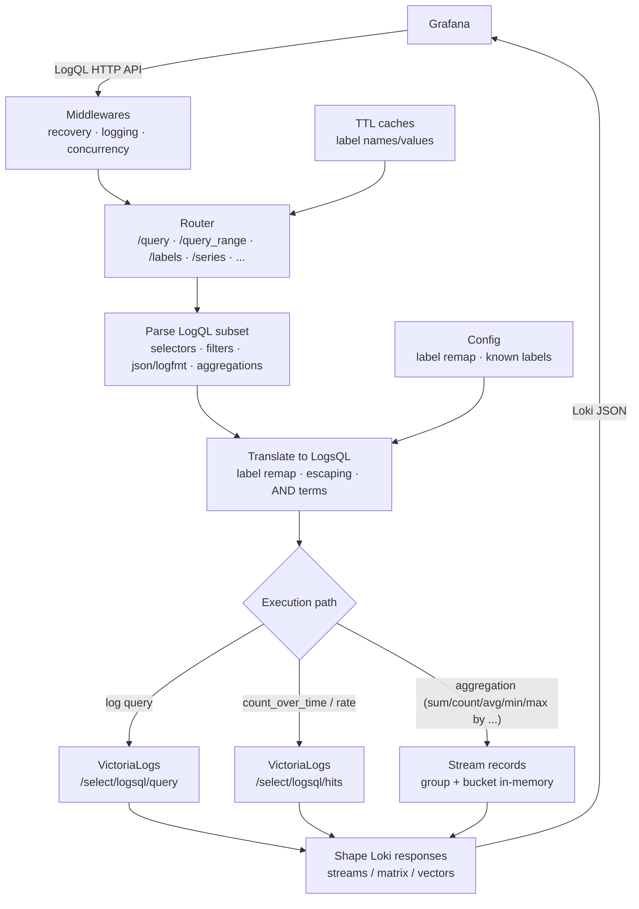

# LogQL (Grafana Loki) to LogsQL (VictoriaLogs)

The main purpose of this proxy is to provide the ability to use **Grafana Logs Drilldown** with a VictoriaLogs data source.

We did not aim to fully cover LogQL syntax or translate all of it to LogsQL.

* [LogQL (Grafana Loki) to LogsQL (VictoriaLogs)](#logql-grafana-loki-to-logsql-victorialogs)
  * [Supported LogQL](#supported-logql)
    * [Stream selectors](#stream-selectors)
    * [Pipeline stages](#pipeline-stages)
    * [Metric wrappers (range vectors)](#metric-wrappers-range-vectors)
    * [Vector aggregations (used by Grafana Drilldown)](#vector-aggregations-used-by-grafana-drilldown)
  * [Supported endpoints](#supported-endpoints)
  * [High-level architecture](#high-level-architecture)
  * [TODO](#todo)
    * [Improvements](#improvements)
    * [Known issues](#known-issues)

## Supported LogQL

This proxy intentionally supports the subset of LogQL emitted by Grafana (notably **Logs Drilldown**).

### Stream selectors

```logql
{label="value", other!="x", re=~"pat.*", nre!~"bad.*"}
{}
```

### Pipeline stages

```logql
{app="api"} |= "text"
{app="api"} != "text"
{app="api"} |~ "err.*"
{app="api"} !~ "err.*"

{app="api"} | json
{app="api"} | logfmt

{namespace="ingress-nginx"} | labels.app.kubernetes.io/name!=""
```

### Metric wrappers (range vectors)

```logql
count_over_time({app="api"}[5m])
rate({app="api"}[5m])
```

### Vector aggregations (used by Grafana Drilldown)

```logql
sum by (detected_level) (count_over_time({app="api"}[2s]))
count by (labels.app.kubernetes.io/name) (count_over_time({namespace="ingress-nginx"}[2s]))
avg by (service) (rate({service="gateway"}[1m]))
min by (service) (rate({service="gateway"}[1m]))
max by (service) (rate({service="gateway"}[1m]))
```

Unsupported LogQL constructs (examples) such as `line_format`, `label_format`, `topk`, etc.
return HTTP 400 with a clear error.

## Supported endpoints

```bash
GET /loki/api/v1/query
GET /loki/api/v1/query_range

GET /loki/api/v1/labels
GET /loki/api/v1/label/{name}/values
GET /loki/api/v1/series
GET /loki/api/v1/detected_labels
GET /loki/api/v1/detected_fields

GET /loki/api/v1/index/stats
GET /loki/api/v1/index/volume
GET /loki/api/v1/index/volume_range
GET /loki/api/v1/drilldown-limits
GET /loki/api/v1/patterns

GET /ready
```

## High-level architecture



## TODO

### Improvements

* [ ] Add `detected_level` label to all logs to support colors on histograms
* [ ] Add allow and deny lists for labels and fields
* [ ] Add metrics
* [ ] Improve logs to show original errors
* [ ] Measure performance and resource usage
* [ ] Make response for `drilldown-limits` configurable
* [ ] Check the logql-to-logsql translator
      [https://github.com/VictoriaMetrics-community/logql-to-logsql/](https://github.com/VictoriaMetrics-community/logql-to-logsql/)
      and maybe reuse it

### Known issues

`DataSources`:

* [ ] Show an error during manual DataSource add in the Grafana UI
  * The proxy most likely returns empty data instead of the expected `1`

`Explorer`:

* [ ] Explore doesn't work

`Log Drilldown` / `Log Summary`:

* [ ] Default view with `service` label doesn't work

`Logs Drilldown` / `Logs Details`:

* [ ] `Log Levels` shows an empty list of levels
* [ ] `Log Volume` shows incorrect data
* [ ] There are no level colors in histograms
* [ ] Some label histograms fail with the error

    ```bash
    "{\"status\":\"error\",\"errorType\":\"execution\",\"error\":\"VictoriaLogs query failed: QueryLogs: VL returned HTTP 400: cannot parse query [namespace:=\\\"consul-service\\\" AND NOT _stream:=\\\"\\\"]: unexpected token \\\"=\\\" instead of '{' in _stream filter; context: [space:=\\\"consul-service\\\" AND NOT _stream:=]\"}\n"
    ```

* [ ] In `Fields`, `Show panels with errors` doesn't work
* [ ] In `Patterns`, it seems to show incorrect graphs
* [ ] Some services' log view crashes with the error:

    ```bash
    An unexpected error happened
      Details
        SyntaxError: Invalid regular expression: /\b([2026-03-16T16:22:37+0000][DEBUG][class|_stream|_stream_id|class|container|date|hostname|labels.app|labels.pod-template-hash|level|namespace|nodename|parse_format|parse_status|pod|source_level|stream|thread)(?:[=:]{1})\b/g: Range out of order in character class

        at r (https://grafana.kubernetes.org/public/build/3688.3a2e7e47341617a764ef.js:1:89431)
        at https://grafana.kubernetes.org/public/build/3688.3a2e7e47341617a764ef.js:1:87961
        at div
        at div
    ```

    or

    ```bash
    SyntaxError: Invalid regular expression:
    /\b(GRPCClient(subType|_stream|_stream_id|container|date|hostname|labels.app.kubernetes.io/component|labels.app.kubernetes.io/instance|labels.app.kubernetes.io/managed-by|labels.app.kubernetes.io/name|labels.app.kubernetes.io/part-of|labels.app.kubernetes.io/version|labels.controller-revision-hash|labels.pod-template-generation|level|namespace|nodename|parse_format|parse_level_unknown|parse_status|pod|stream|svc|traceparent)(?:[=:]{1})\b/g:
    Unterminated group

    at r (https://grafana.kubernetes.org/public/build/3688.3a2e7e47341617a764ef.js:1:89431)
    at https://grafana.kubernetes.org/public/build/3688.3a2e7e47341617a764ef.js:1:87961
    ```

* [ ] `Include` patterns doesn't work
